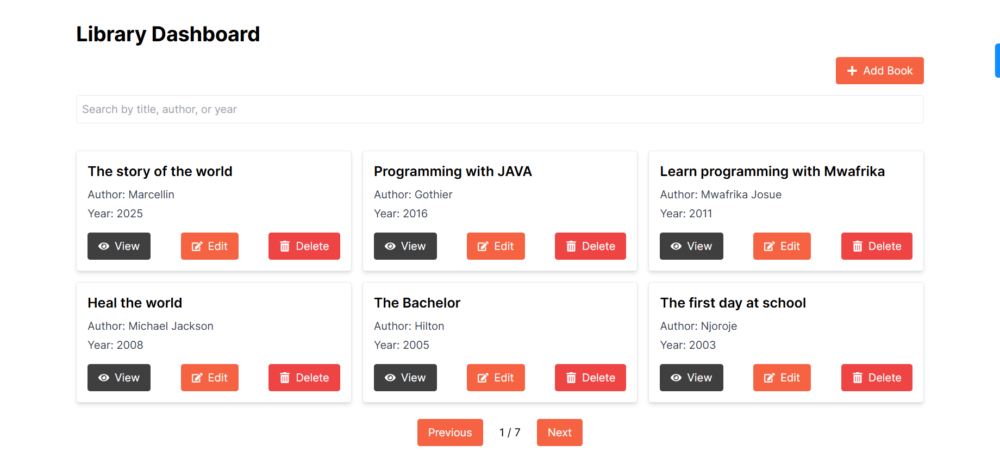
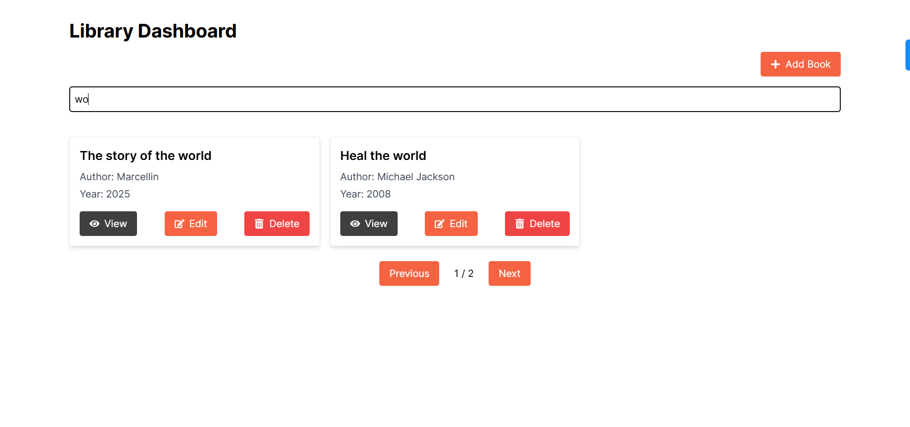
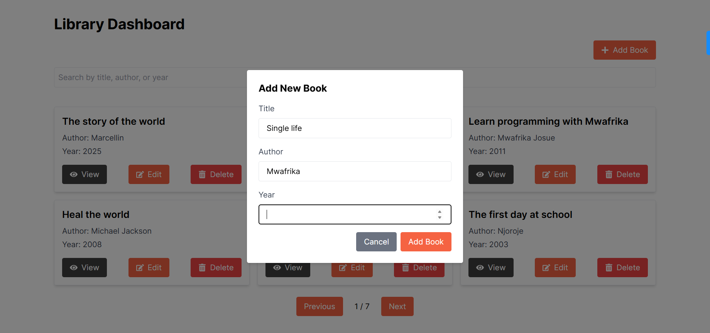
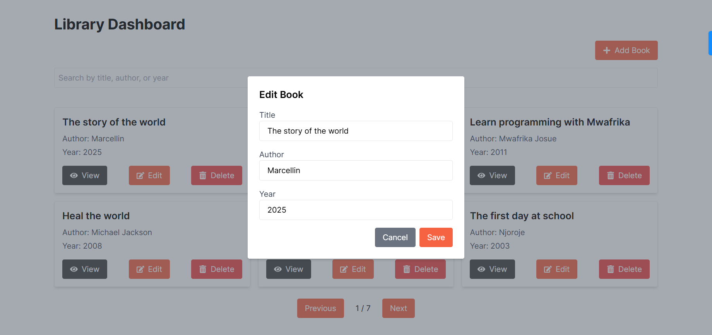
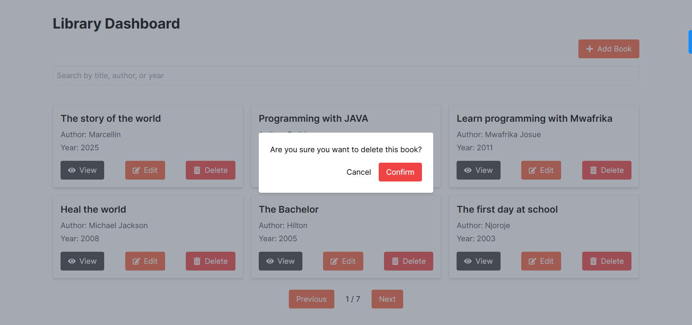

# Library Management System

## Overview
The Library Management System is a powerful and flexible server application built with Go (Golang) and the Gin framework, designed to efficiently manage books. It provides a RESTful API for performing various book-related operations such as adding, updating, deleting, and retrieving books. Additionally, it offers functionality to process URLs for redirection and canonicalization.

## Live Server for the project

### [Click here to access the Live site and enjoy testing](https://library-manage-systeme.vercel.app/) 

## Table of Contents
- [Features]()
- [Installation]()
- [Configuration]()
- [Running the Application]()
- [Screenshots]()
- [Project Structure]()
- [Endpoint Usage]()
- [Development]()

## Features
- **Dashboard**: Lists all books with options to add, edit, view in detail, and delete books.
- **Forms**: For adding new books and editing existing ones.
- **Book Entry**: Displays basic information such as title, author, and year of publication.
- **Modal Dialogs**: Used for form submissions to enhance user experience.
- **State Management**: Utilized Context API to manage state across components.
- **Client-Side Validation**: Includes visual feedback for required fields.
- **Controlled Components**: Used for form inputs to handle form data.
- **Dynamic Routing**: Set up for viewing individual book details.
- **Error Handling**: Provides user-friendly messages for network issues and form errors.

## Installation
### Prerequisites
- Node.js (>= 14.x.x)
- npm or yarn

## Steps
1. Clone the repository:
```js
git clone https://github.com/mwafrika/byfood-test-frontend.git
cd byfood-test-frontend
```
2. Install dependencies:
```js
npm install
```
Or

```js
yarn install
```
## Configuration
1. Create a .env file in the root directory and add necessary environment variables
```js
NEXT_PUBLIC_API_URL=http://localhost:7000/api
```

## Running the Application
```js
npm run dev
```
Or

```js
yarn dev
```
2. Open your browser and navigate to http://localhost:3000

## Project Structure
```js
.
├── app
│   ├── components
│   │   ├── AddBookForm.tsx
│   │   ├── BookCard.tsx
│   │   ├── ConfirmDeleteDialog.tsx
│   │   ├── EditBookForm.tsx
│   │   └── Spinner.tsx
│   ├── contexts
│   │   └── BookContext.tsx
│   ├── dashboard
│   │   ├── books
│   │   │   └── [id]
│   │   │       └── page.tsx
│   │   └── page.tsx
│   ├── fetcher
│   │   └── api.tsx
│   ├── globals.css
│   ├── layout.tsx
│   └── page.tsx
├── public
├── .eslintrc.json
├── .gitignore
├── next.config.mjs
├── package-lock.json
├── package.json
├── postcss.config.ts
├── tsconfig.json
└── tailwindcss.config.ts
```

## Screenshots

### 1. Home Page


### 2. Dashboard with the list of books with pagination and search input


### 3. Searching books by title, author or year of publication 


### 4. Modal to add New Book


### 5. Modal to edit an existing Book


### 6. Confirmation dialog to delete a book



## Endpoint Usage

### API Endpoints

All the information about the endpoints can be found [here on Live Server](https://reliable-germana-mwafrika-f5c060f5.koyeb.app/api/docs/index.html#/)
or [To the backeck repository for this project](https://github.com/mwafrika/byfood-test-backend)

## Styling
Configuration is handled in tailwind.config.js and imported in app/tailwind.css

